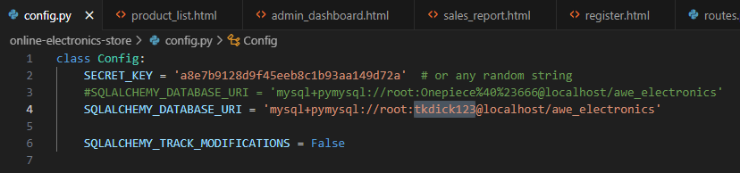
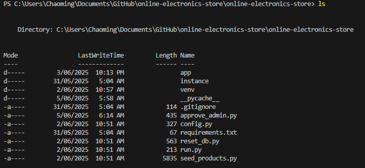

# AWE Electronics Store

## Project Overview

This project is a Flask-based online electronics store system that is designed to handle various aspects of an e-commerce website. These operations include the management of products, orders, cart items, payments, users (owner and customers), and messages.

## Technologies Used

- **Flask**: The web application framework used for implementing the system.
- **MySQL Workbench**: The database used for development.
- **Bootstrap**: The front-end framework used to develop the UI/UX of the application.

## Installation

To run a local version of this project:

1. Download the ZIP file of the project and extract it.
2. Open a terminal in the project folder.
3. If the virtual environment is not already created:
   - Run `python -m venv venv`
   - Activate the environment:
     - On Windows: `venv\Scripts\activate`
4. Install dependencies with:  
   `pip install -r requirements.txt`

## Usage

Ensure MySQL Workbench is installed and configured as follows:

1. Open MySQL Workbench.
2. Create a new connection on your local instance:
   - Username: `root`
- Password: `tkdick123` (or 
3. Create a schema named `awe_electronics`.
4. Run `reset_db.py` in the project directory to create required tables.
5. Run `seeded_products.py` to insert dummy product data for initial use.

## Running the Application

After setting up the database and adding initial product data:

1. Navigate to the project directory (Make sure that you are in the correct directory where the files exist)

2. Run the application
3. Visit `http://127.0.0.1:5000/` in your browser.

## Account Setup

1. Register a user with the following details:
- Name: Siam (or any name)
- Email: `siam@gmail.com`
- Password: `siam1234`
2. Run `approve_admin.py` to set up the default admin/owner account.

Once completed, the website will be fully functional and ready for testing.

## Acknowledgement of Resources 

This is a product from Unit SWE30003-Software Architectures and Design, Swinburne University of Technology.

© AWE Electronics Store Project
